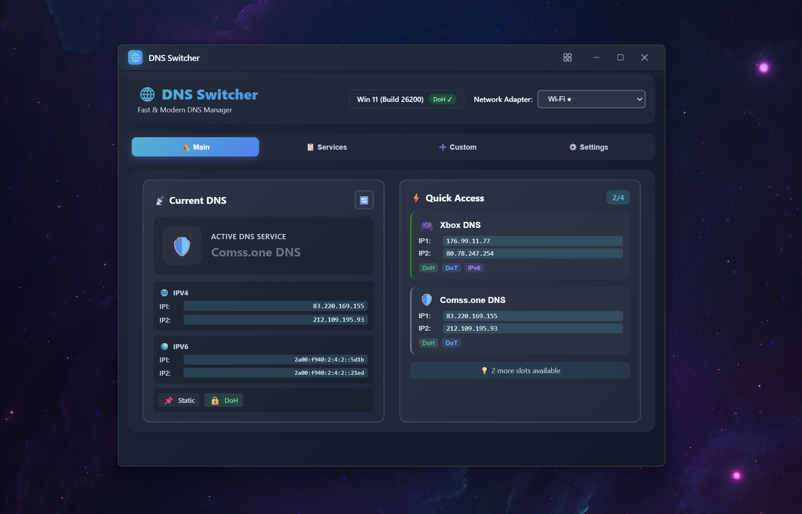
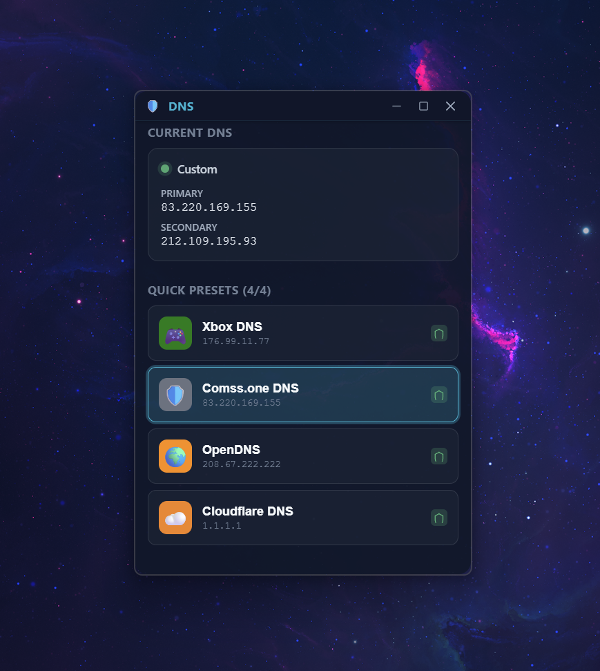

# DNS Switcher

<div align="center">


# DNS Switcher

*A lightweight DNS switcher for Windows with system tray and mini app integration*

Switch between DNS providers instantly with a clean, modern interface.

[](https://github.com/YOUR_USERNAME/dns-switcher/releases)
[](LICENSE)
[](https://github.com/YOUR_USERNAME/dns-switcher/releases)

[Download](../../releases) • [Features](#features) • [Screenshots](#screenshots) • [Documentation](./docs/)

</div>

## Why DNS Switcher?

Changing DNS settings manually through Windows network settings is tedious. This app makes it instant:

- **One-click switching** between popular DNS providers (Cloudflare, Google, Quad9, AdGuard, etc.)
- **Custom presets** for your own DNS servers
- **System tray** for quick access
- **Mini mode** that stays out of your way
- **Micro mode** - ultra-compact always-on-top widget
- **Dark/Light theme** support 50/50

Perfect for developers, privacy-conscious users, or anyone who needs to switch DNS frequently.

Screenshots
<div align="center">
<table>
<tr>
<td align="center" width="50%">
<b>Main Window</b><br/>

</td>
<td align="center" width="50%">
<b>Compact Modes</b><br/>

<br/><br/>

</td>
</tr>
</table>
Mini mode for quick access, Micro mode for always-on-top widget
</div>

## Features

**Quick Presets**

- Pre-configured DNS providers ready to use
- Popular services: Cloudflare (1.1.1.1), Google (8.8.8.8), Quad9, OpenDNS, and more
- Privacy-focused options like AdGuard DNS

**Custom DNS**

- Add your own DNS servers
- Create custom lists for different use cases
- Filter and search through your presets

**Smart Interface**

- Shows current active DNS
- Real-time status updates
- Mini mode for compact view
- Micro mode - ultra-compact widget that stays on top
- Minimal resource usage (~20MB RAM)
- Runs in the background via system tray

**Developer-Friendly**

- Built with Tauri (Rust + Web) for speed and security
- Small installer size (~5MB)
- Open source and transparent

## Download

Grab the latest version from the [Releases](../../releases) page.

**Windows 10/11 Required** | ~5MB installer

## Quick Start

1. Download and run the installer
2. Click a DNS preset to apply it instantly
3. Use the system tray icon for quick access
4. Switch to mini mode for a compact view
5. Or use micro mode for an always-on-top widget

That's it. No configuration needed.

## Building from Source

Want to compile it yourself? Here's how.

### Prerequisites

```bash
# Install Rust
curl --proto '=https' --tlsv1.2 -sSf https://sh.rustup.rs | sh

# Install Node.js (v18+)
# Download from nodejs.org or use nvm
```

### Build Steps

```bash
# Clone the repo
git clone https://github.com/yourusername/dns-switcher.git
cd dns-switcher

# Install dependencies
npm install

# Run in development mode
npm run tauri dev

# Build for production
npm run tauri build
```

The installer will be in `src-tauri/target/release/bundle/`.

## Tech Stack

- **Frontend**: SvelteKit + TypeScript
- **Backend**: Rust (Tauri)
- **Styling**: Custom CSS (no frameworks)
- **Build**: Vite

Why Tauri? Smaller binaries, better performance, and native integration compared to Electron.

## How It Works

The app uses Windows `netsh` commands under the hood to modify network adapter DNS settings. All operations require admin privileges, which is why you'll see a UAC prompt on first launch.

DNS changes are applied per network adapter, not globally. This is actually better because it respects your network configuration.

## Contributing

Found a bug? Have an idea?

1. Check existing [issues](../../issues) first
2. Open a new issue with details
3. PRs welcome (please open an issue first to discuss)

Keep it simple. The goal is a clean, fast DNS switcher, not a network management suite.

## Known Issues

- **First launch** requires admin rights (Windows limitation)
- **VPN software** may override DNS settings
- **Multiple adapters** will all get the same DNS (by design)

## Roadmap

Things I'm considering:

- [ ] macOS and Linux support
- [ ] DNS-over-HTTPS (DoH) configuration
- [ ] Network profile detection (home/work presets)
- [ ] DNS latency testing
- [ ] Import/export presets

No promises on timeline. Suggestions welcome.

## License

Apache 2.0 — see [LICENSE](LICENSE) file.

Free to use, modify, and distribute. If you build something cool with it, let me know.

## Credits

Built by someone tired of clicking through Windows network settings.

DNS provider logos and info from their respective companies. This app is not affiliated with any DNS provider.

---

**Like this project?** Star it on GitHub or share it with someone who hates changing DNS settings.

**Issues?** Check the [troubleshooting guide](./docs/TROUBLESHOOTING.md) or open an issue.
